# 快速入门
:::tip

该部分为 `ChatGPT` 快速入门，对需要的操作汇总，可以结合自身需求选择是否跳过

:::

## 信息汇总

- OpenAI官网: https://openai.com/
- ChatGPT官网: https://chat.openai.com/
- Pandora项目网站: https://chat.oaifree.com
- PandoraNext的GitHub地址:https://github.com/pandora-next/deploy

## 概念
### 控制台
PC端可使用 `F12` 打开如下页面

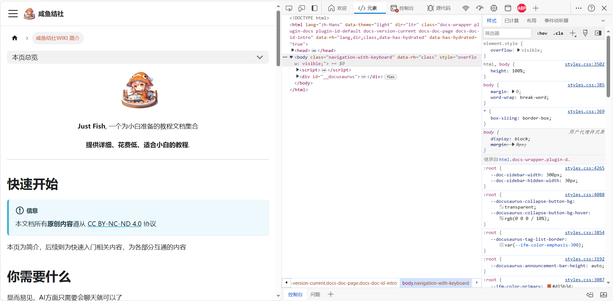

手机端可以通过浏览器自带功能打开 `调试台`

### 请求

于**控制台**中打开此部分，可看到 `请求列表`

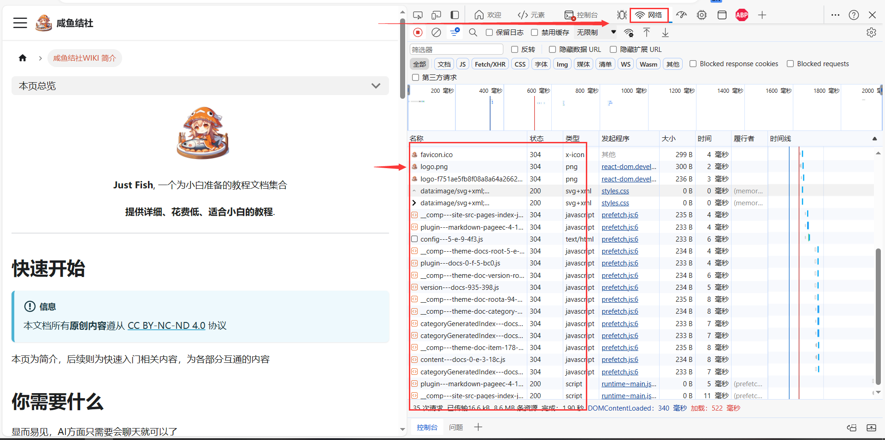

点击请求，可查看详细信息
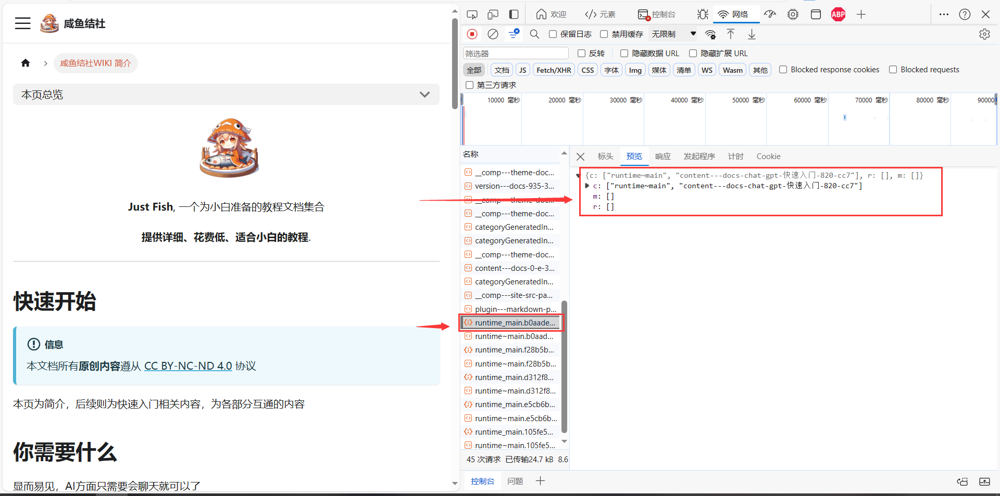

## 操作
### 域名以及域名邮箱
此部分讲解如何获取属于你自己的域名和域名邮箱

域名邮箱如: `admin@justfish.top`
#### 申请域名
访问: [域名注册商NameSilo](www.namesilo.com)

注册账号并登录
:::info

请输入英文域名，中文域名会导致无法注册

:::

于 `NameSilo` 输入域名后搜索会显示可注册的域名和价格

出现购物车标志即为可注册，根据价格挑选合适的域名，点击购物车即可

:::warning

目前已知 .cn（包括.com.cn等） .top 域名后缀的注册是不被OpenAI支持的。

目前已知 .com .org .net .io .do .fun .xyz .cc .me .cool .link 后缀可注册OpenAI

信息来源: [链接](https://zhile.io/2023/12/09/pandoranext-introduction.html)

:::
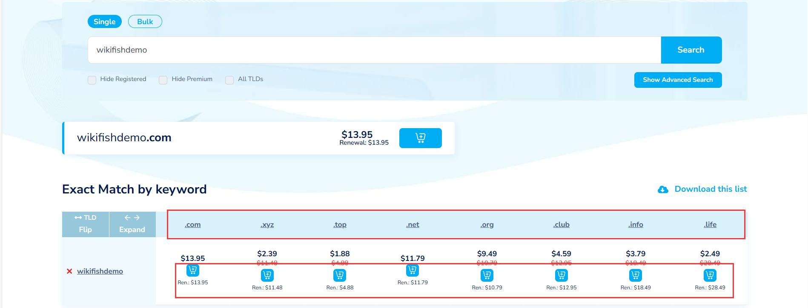

于右上角购物车可查看订单，点击 `View Cart` 即可进入支付页面

随后点击 `CHECKOUT` 即可

可能需要填写地址，地址均可填写 `BeiJing`

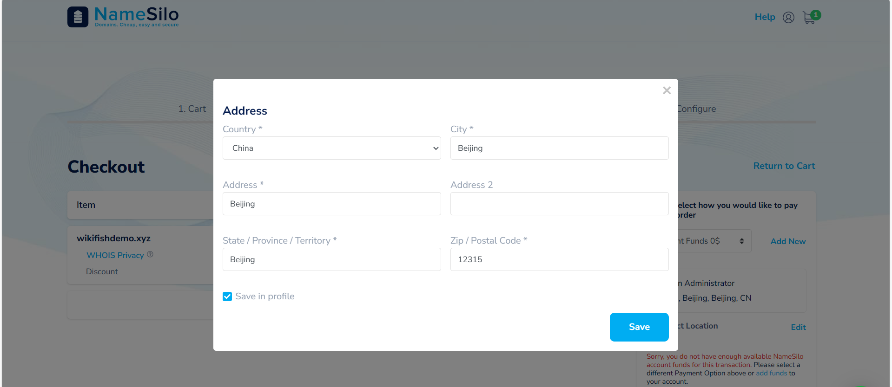

于最下方同意条款并支付

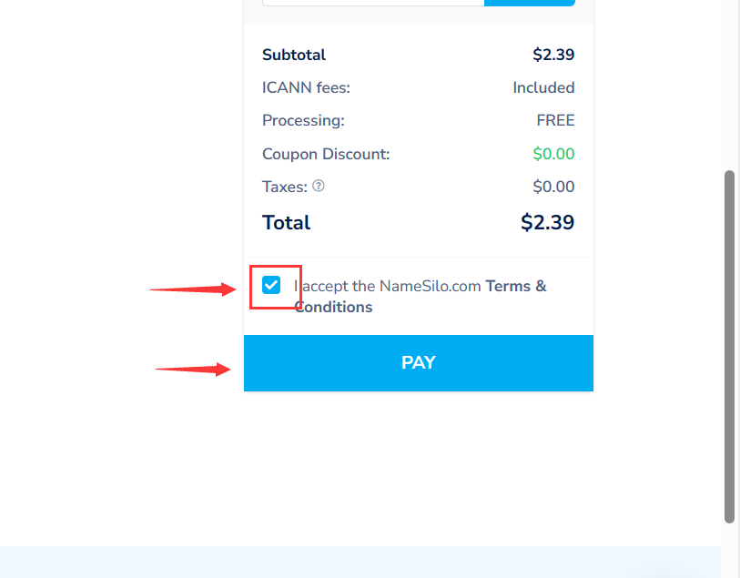

选择支付宝，点击红色按钮即可支付，支付完成后即完成域名注册

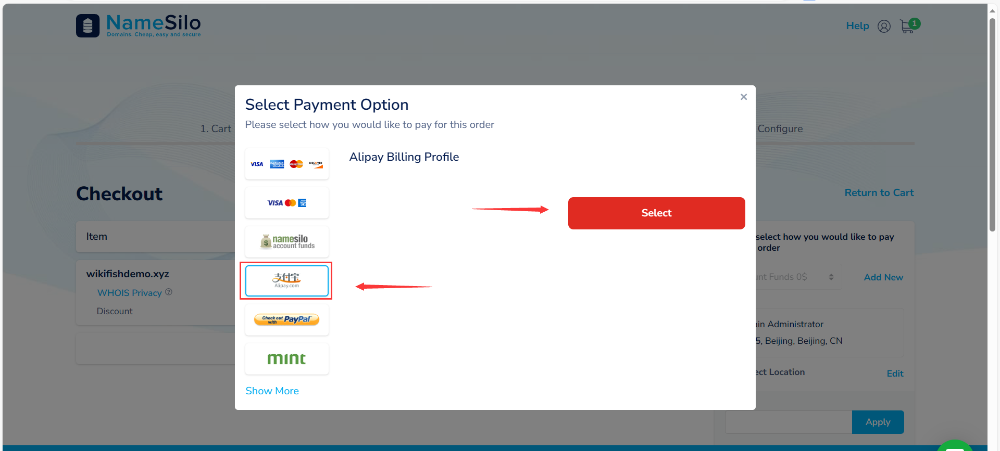

#### 域名邮箱

进入CloudFlare官网: [www.cloudflare.com](www.cloudflare.com)

注册并登录

在个人界面选择 `网站` 并点击 `添加站点`

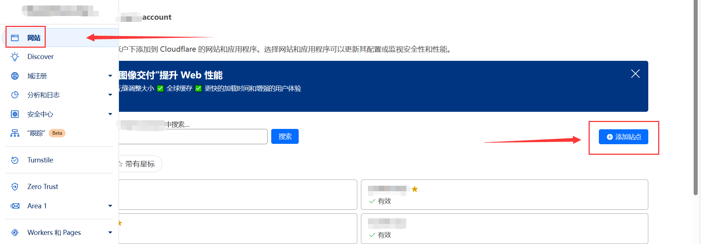

填写个人域名并继续，随后选择底部 `Free计划`

等待加载完毕后继续下一步，在该页面复制以下两个内容

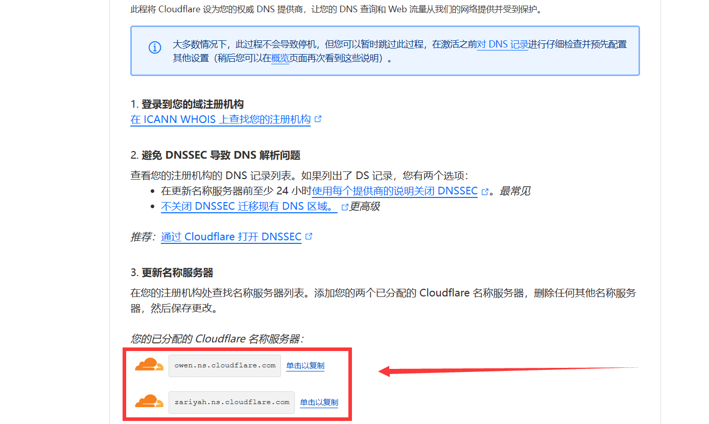

随后

进入 `NameSilo` 个人页面,于左侧选择 `Domain Manager`

点击个人域名
:::info

点击图中位置，而不是右侧的选项

:::

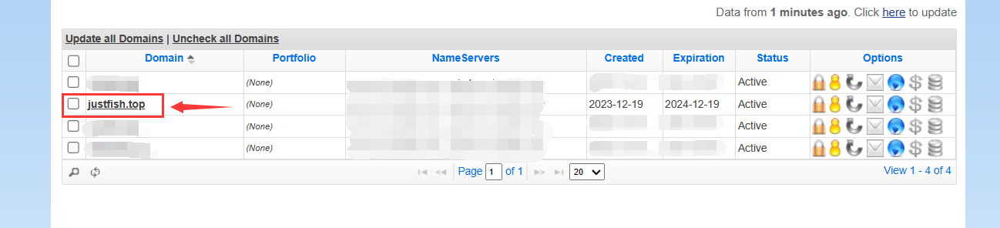

在该位置点击 `Change`

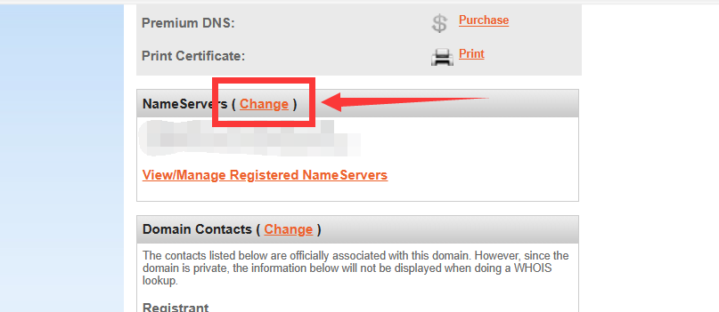

将刚刚复制好的两条内容填入此处，并删除多余的记录，只留下这两条

保存后即可关闭

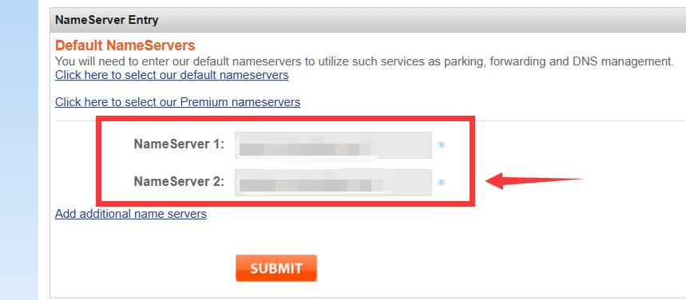

随后返回 `CloudFlare` 继续下一步

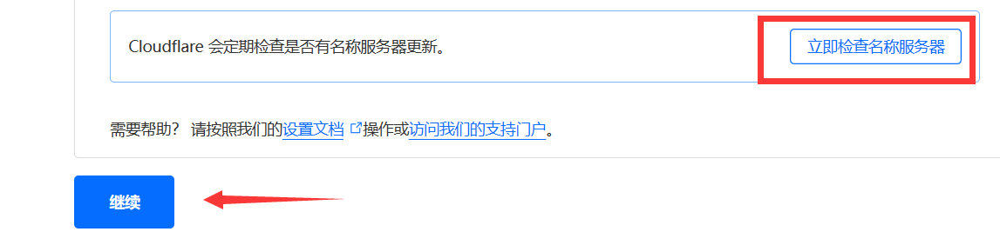

等待CloudFlare的邮件通知 “域名已可用” ，大概需要半小时左右

等待可用后，如图所示操作，输入自己的常用邮箱和想要的域名邮箱地址

:::info

此处输入完邮箱需要在出现的栏目中点击一下才可成功输入！

:::

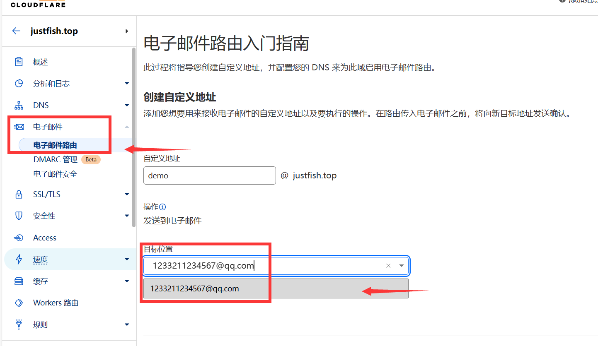

选择创建并继续，验证邮箱即可

验证完毕邮箱，返回路由页面，如下图所示即可

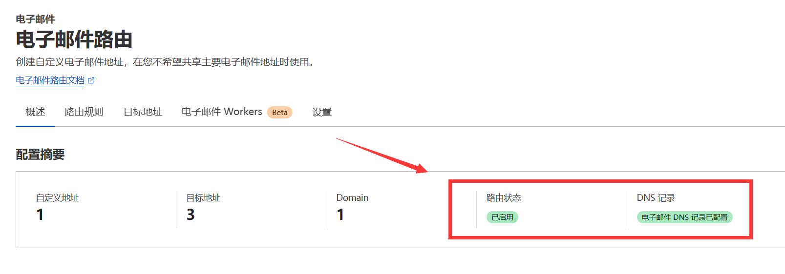

点击路由规则，如以下界面则已成功启用域名邮箱

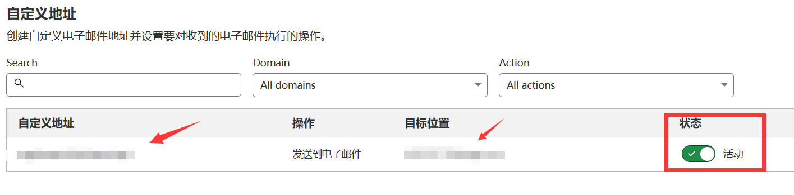

如需批量注册域名邮箱只需重复创建域名邮箱地址即可