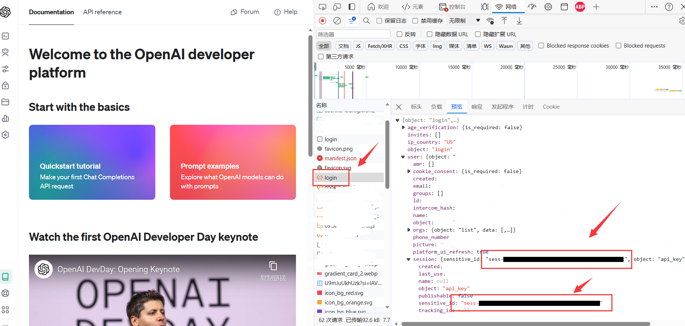

# 获取API
:::info

在继续之前，推荐您先阅读《[《ChatGPT - 快速入门 - 概念》](./快速入门.md#概念)》部分，可以快速帮你熟悉操作

:::

## 无绑定手机抓取


访问OpenAI官网: https://openai.com/ 并登录, 选择 `API选项`


打开 `控制台` 并选择 `网络` 栏,  刷新页面，找到 `login` 请求 ，查看详情

图中红框位置即为API ，完整格式如下
```
sess-Xxxxxxxxxxxxxxxxxxxxxxxxxxxx
```



WIP