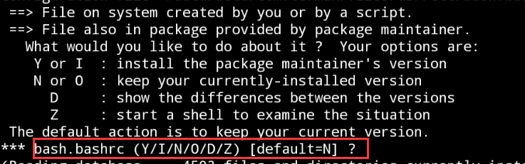

# 安卓端本地搭建酒馆
:::info

在继续之前，推荐您先阅读《快速入门》部分，可以快速帮你熟悉操作

:::
:::warning

本部分内容对小白来说容易出现各种问题，如果出现问题**请耐心排查或在群内询问**

本教程内截图均来自模拟器,可能**因为手机系统的不同导致页面不同**，但操作大同小异

建议**全程在魔法环境**(最好为US地区)下进行

:::

## 安装终端软件
安卓端建议使用 `Termux`
:::info

[点击此处下载 `Termux`](./assets/termux-app_v0.118.0+github-debug_x86_64.apk)

如果安装包出现问题可前往项目地址下载 https://github.com/termux/termux-app/releases

:::

安装完毕后启动，如下页面即可


## 基础配置
### 换源
终端内输入以下内容
```
termux-change-repo
```
出现页面中选中红框内选项，点击`OK`即可


随后使用上下左右选择图中红框内选项即可(两个均可)


点击`OK`
### apt更新
```
apt update && apt upgrade
```
出现以下页面，输入`Y` (大写)继续即可


如果命令行停住出现类似以下内容，输入`Y` (大写)继续即可


更新完毕且无报错后进行下一步

如出现报错请检查梯子或命令行输入是否准确

### pkg更新
```
pkg update && pkg upgrade
```
同上，若出现询问是否继续等内容输入`Y`(大写) 

更新完毕且无报错后进行下一步

如出现报错请检查梯子或命令行输入是否准确

### 安装vim
```
pkg install vim
```
询问是否继续等内容请输入大写的 `Y` 并回车

安装完毕即可

## 安装Ubuntu

:::warning

本部分出错率较高，请细心阅读文档

:::

Centos已停止维护，为方便教学，统一格式，建议使用Ubuntu系统

终端输入以下内容
```
// 安装容器
pkg install proot-distro 
```

同上，出现 询问是否继续等内容请输入大写的 `Y`


```
// 安装Ubuntu 系统
proot-distro install ubuntu
```
耐心等待安装完成即可

```
// 启动Ubuntu 系统
proot-distro login ubuntu
```

WIP


