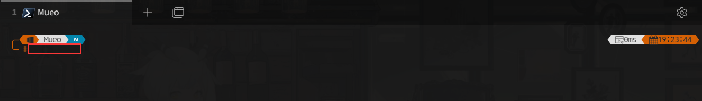
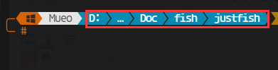

# 快速入门

:::tip

该部分为 `Claude` 快速入门，对需要的操作汇总，可以结合自身需求选择是否跳过

:::

本章内容使用[@teralomaniac](https://rentry.org/teralomaniac_clewd) 提供的Clewd

站在巨人的肩膀上，感谢大佬分享

本部分提供PC端+安卓双端，以及VPS部署教程


## 信息汇总

- Claude官网: https://www.anthropic.com/product
- 酒馆项目地址: https://github.com/SillyTavern/SillyTavern
- Clewd项目地址: https://github.com/teralomaniac/clewd

## 概念

### 终端
用于输入命令行

终端打开界面如下(可能存在外观差异和前缀差异)

图中红框部分为命令行输入位置



图中红框部分结构通常为目录，表示当前所在目录



可自行选择终端软件

### 注释
为注解，解释说明作用，请勿输入终端中
```
// 下面代码的作用为xxx
npm install xxx
```
### 命令行
#### 安装
常见格式为
```
aaa install bbb
```
`aaa` 部分可理解为应用商店：比如华为软件商店

`install` 为常见的安装指令，中文意思为 安装

`bbb` 为软件名，需输入软件全称

比如 使用华为的软件库安装qq(例子为方便理解捏造的名字！)
```
华为 install qq  
```
#### Linux命令行
为统一格式，均采用 `Ubuntu` 系统的命令行

只供理解熟悉，内容并不严谨！

**Ubuntu常用命令行有以下内容**
```
// 安装xxx
apt install xxx 

// 获取更新列表
apt update

// 更新内容
apt upgrade
```
`update` 为获取更新列表。比如出门买菜，统计需要买的菜

`upgrade` 为更新。也就是买菜

**Linux系统通用命令**
```
// 打开xxx目录
cd xxxx

// 运行xxx脚本
bash xxx

// 编辑某个文本文件(如xx.js、xx.txt等等)
vim xxx
```
`cd` 打开目录，比如:
```
cd D:\Desktop\attached\Code\Doc\fish\justfish
```
`vim` 使用vim编辑当前目录某个文件
```
vim justfish.js 

// 或者打开非本目录文件
vim aaa/bbb/justfish.js
```
**Node.js常用命令**
```
// 使用npm 安装
npm install xxx

// 直接运行则为安装该目录下项目的依赖
npm install

// 用node启动xxx.js文件
node xxx.js
```