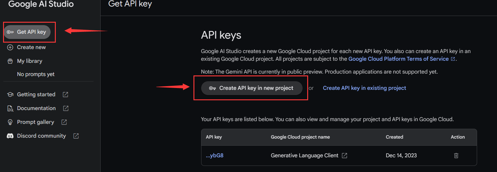
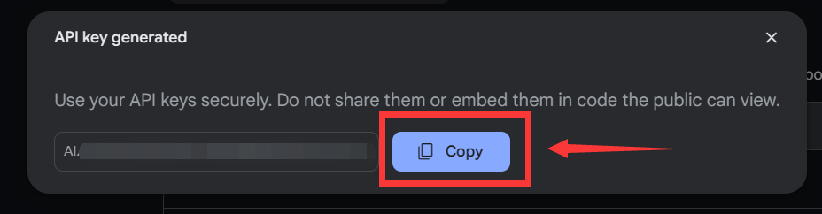

# 获取API
:::info

在继续之前，推荐您先阅读《快速入门》部分，可以快速帮你熟悉操作

:::

:::warning

本部分内容尚未修订。可能内容并不详细或废话太多

:::

## 快速开始

谷歌AI官网: https://ai.google.dev/

进入后点击 `Get API key in Google AI Studio` 按钮即可进入开发者后台

使用自己的谷歌账号登录即可

:::tip

如果提示无权限，可以更换节点尝试，但请注意使用US地区节点

:::

在后台选择 `Get API Key` ， 点击 ` Create API key in new project `

点击 `Copy` 即可将Key复制

请妥善保管自己的API，如若泄漏请及时来后台删除并生成新的Key